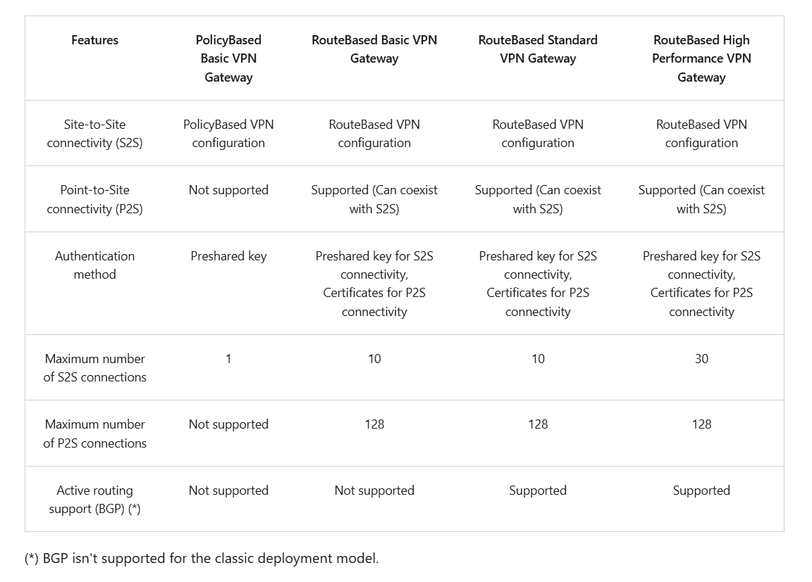
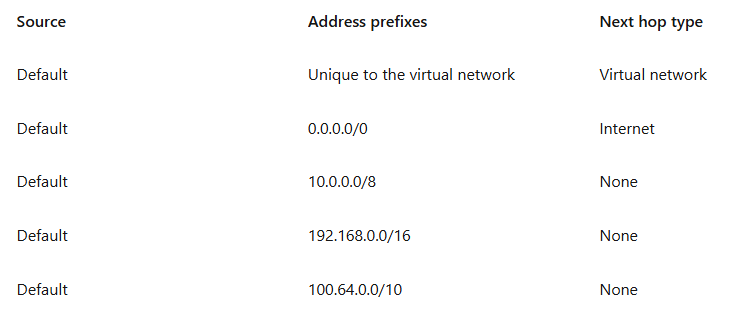
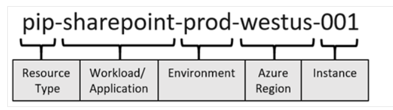

## Azure Network Engineer (AZ-700)

**I'm going to also publicly document my notes for the Azure Network Engineer certification (AZ-700) exam. I'm currently applying for cloud engineer roles so I think this will augment my skills in the meantime. I definitely want to take this exam but I'll probably do that after I actually get the job.**

## 03.17.2025
**Today's Topic**
* Design and implement Azure ExpressRoute
________________________
Design an ExpressRoute deployment

ExpressRoute locations are called peering locations or meet-me-locations. They are colocation facilities where Microsoft Enterprise Edge (MSEE) devices are located. These locations are the entry point to Microsoft's network. They are globally distributed.

They also have satellite options as well. Never knew this. There are also three SKUs for ExpressRoute: Local, Standard and Premium. Local is all unlimited. Standard and Premium can be unlimited or metered. 

The usage of the Microsoft Global Network is charged on top of the ExpressRoute Direct. 

But yes

## 03.16.2025
**Today's Topic**
* Design and implement Azure ExpressRoute
________________________
Explore Azure ExpressRoute

Azure ExpressRoute is just a direct connection from your on-prem equipment to the Azure cloud. Your traffic does not traverse the public internet. There are several ways to implement it:
* Co-located at a cloud exchange - virtual cross-connections to the Microsoft cloud are provided through the colocation provider's Ethernet exchange. This can be either L2 or L3.
* P2P Ethernet connections - a P2P Ethernet provider can offer Layer 2 or L3 connections to Microsoft cloud
* Any-to-any (IPVPN) networks - IPVPN providers offer any-to-any connectivity between branch offices and datacenters. This is typically L3.
* Direct from ExpressRoute sites - I guess there's an ExpressRoute Direct site?

Quick detour on data centers, data center is an umbrella term. It's where all your hardware resources live. Your company can have it's own data center (private) or it can share a data center with other companies (colocation like TierPoint). In a colocation, you provide your own hardware but the data center owner (like TierPoint) takes care of cooling, power requirements, security, etc. If you had your own data center, you would have to manage everything from the facility to the hardware. A cloud data center is where you don't have to worry about anything from the facility to the hardware. You just rent the resources you need. Datacenter is like IaaS. Colocation is like PaaS. Cloud is like SaaS. 

Lets also go over the 4 bullets points above. Okay first off, co-locations like TierPoint and Equinix have what's called a Cloud Exchange at their locations. These cloud exchanges are where you can plug directly into a Layer 2 (literally Ethernet cable) or Layer 3 (a colocation routed highway) connection into one of the cloud providers. Think of it like an airport where the companies pull up and go directly to their cloud provider terminal. 

P2P Ethernet connections are when your ISP provider gives you an Ethernet cable or their own L3 routes to get directly to your cloud provider. Direct from ExpressRoute sites is the same thing except Microsoft gives you the Ethernet cable, not your ISP. 

Any-to-any just means all sites can talk to each other. Its a mesh network. Any one site can talk directly to another site. They're all connected through a mesh. Think of IPVPN as this but the WAN version. How does this work? Your ISP provides an MPLS network for you. So one of your extra "sites" would just be Microsoft. It would be treated like any other branch. 

Lets get redundant. You can configure a S2S VPN for an ExpressRoute backup. You can also do zone redundant gateways as well. 

## 03.15.2025
**Today's Topic**
* Design and implement hybrid networking
________________________
Connect networks with Site-to-Site and Point-to-Site VPN connections

P2S VPN can use one of the following protocols:
* OpenVPN protocol (which is an SSL/TLS based VPN protocol). Supported by all OSs.
* Secure Socket Tunneling Protocol (SSTP) (which is a proprietary TLS-based VPN protocol). Only supported by Windows OS.
* IKEv2 VPN (which is a standards-based IPsec VPN). Supported by Mac devices.

These P2S users have to be authenticated either by native Azure certificate (needs to be installed on each client computer), Microsoft Entra ID (only supported by OpenVPN and Windows 10. Needs an Azure VPN Client), or Active Directory Domain Services (requires RADIUS server and Azure needs to be able to reach this server). 

Azure Virtual WAN is a networking sevice that brings many networking, security, and routing functionalities together to provide a single operational interface. Inlcudes:
* Branch connectivity
* S2S VPN
* P2S VPN
* Private connectivity (ExpressRoute)
* Intra-cloud connectivity
* Routing, Azure Firewall, and encryption for pvirate connectivity

To create a virtual WAN, you need a Virtual WAN, Hub, Hub virtual network connection, Hub-to-hub connection and Hub route table. 

A Virtual WAN can have multiple hubs. Virual WANs are isolated from each other and cant contain a common hub. Hubs in different virtual WANs can't communicate with each other. You have two Virtual WANs SKUs: Basic and Standard. The Basic can only do S2S VPN. The Standard can do everything. 

A virtual hub is a Microsoft-managed VNet. It has various service endpoints. The hub is the core of your network in a region. The minimum address space for a hub is /24. 

You hub also has a gateway that would act as a VPN gateway to connect to your Azure Vnets. 

Virtual Hub routing uses BGP. You can also create a virtual hub route and put them in the routing tables. 

When you create an NVA in the Virtual WAN hub, you get two RGs: A Customer resource group and a managed resource group. The NVA is configured automatically and once it's provisioned, you cant access the NVA directly. 

An NVA Infrastructure Unit is similar to a VPN Scale Unit in terms of the way you think about capacity and sizing. 

## 03.14.2025
**Today's Topic**
* Design and implement hybrid networking
________________________
Design and implement Azure VPN Gateway

The type of VPN you choose depends on the make and model of your VPN device and the kind of VPN connection you intend to create. Most likely it will be RouteBased. You'll need RouteBased for IKEv2. Your SKU affects the number of tunnels and throughput so keep that in mind. Remember, you can't change across generations. You'll have to delete your VPN and make a new one. A VNet can't be associated with more than one gateway. 

Each VPN Gateway requires a gateway subnet. It contains the IP addresses that the virtual network gateway VMs and services use. It has to be named `GatewaySubnet`. 

Next, create the local network gateway. This is the information for the on-prem VPN device. It can be either an PIP or an FQDN. You can also specificy with address prefix to route through the VPN gateway to the VPN device here. The address prefix here is the prefixes located in the on-prem network. You can also use BGP here to make it easier. If this is the case, then the minimum prefix you need to decalre is the host address of your BGP Peer IP address on your VPN device. 

Now, configure your on-prem VPN device. There's a list of devices that Azure works with. Search for this. You'll need to configure a shared key and the PIP of your VPN gateway in Azure. 

Now, you can actually create the connection between them. You'll need to name this connection, select the proper Connection type (such as S2S), and the enter the PSK. Finally, verify that everything is working. 

HA for VPN has the following options: VPN Gatway redundancy (active-standby), multiple on-prem VPN devices, active-actvie Azure VPN gateway, and combinations of all of these. 

Every Azure VPN gateway consists of two instances in an active-standby configuration. For any planned maintenance or unplanned disruption to the active instance, the standby instance would take over automatically. This is for S2S connections. For P2S, the connections are disconnected and the user has to reconnect. 

If you use multiple VPN devices on-prem, you can make an active-active mode (which is separate from the active-standby set up which is still in place). This requires the local nework gateway to have a unique PIP and for BGP to be used. Each local gateway must have a unique BGP peer IP address. You must also use Equal-cost multi-path routing (ECMP). 

There are articles on the Microsoft Azure VPN Gateway site that tells you how to troubleshoot common gateway issues. Check it out if you need it. 

There are also Azure VPN Gateway diagnostic logs. I believe these are found in Azure Monitor. You have Gateway, Tunnel, Route, IKE, and P2S Diagnostic Logs. Very useful. 

## 03.13.2025
**Today's Topic**
* Design and implement hybrid networking
________________________
Design and implement Azure VPN Gateway

A VPN gateway provides an endpoint for incoming connections to an Azure virtual network. It sends encrypted traffic over the internet. It can also be used to connect separate Azure VNets using encrypted tunnels across the Microsoft network backbone. 

Side note, a virtual network gateway is made up of two or more special VMs that are deployed on the gateway subnet. These VMs host routing tables and run specific gateway services. They are managed by Azure. 

When planning a gateway, there are three different architectures: P2S, S2S over internet, and S2S over ExpressRoute. 

You need to plan for throughput, backbone or not, availability of PIP, VPN device compatibility, VPN gateway type, and Gateway SKU. 

Some notes to consider: Use Virtual WAN if you need more than 30 S2S VPN tunnels. Resizing of the VpnGw SKU is allowed within the same generation except for the Basic SKU. A max throughput of 1Gbps can be achieved on one single tunnel. The aggregate throughput benchmark for a VPN gateway is S2S + P2S combined. 

There are two VPN types: PolicyBased and RouteBased. Lets start with PolicyBased

PolicyBased VPNs were previously called static routing gateways. They handle traffic through IPsec tunnels based on IPsec policies. The policy is defined as an access list in the VPN device configuration. The value for a PolicyBased VPN type is PolicyBased. Policy based VPNs which support IKEv1 protocols can be used with the Basic Gateway SKUs only. You can only have one tunnel when using a PolicyBased VPN. You can only use a PolicyBased VPN for S2S connections. Most VPN Gateway configurations require a RouteBased VPN. 

RouteBased VPNs were previously called dynamic routing gateways. They use routes in the IP forwarding or routing table to send traffic to the right tunnel interfaces. The tunnel interfaces then encrypt the traffic. The policy for RouteBased VPNs are configured as any-to-any. 

There's a table that tells you the S2S and P2S connection information for each PolicyBased and RouteBased type. This will definitely be important. 

## 03.12.2025
**Today's Topic**
* Introduction to Azure Virtual Networks
________________________
Configure internet access with Azure Virtual NAT

You already know what this is for due to that Load Balancer lab you did. NAT gateways work just like Cisco NAT and they allow Azure resources to go to the internet without needing a dedicated PIP. The Azure resource can have a private IP, go to the NAT Gateway, and then get out to the internet. NAT takes precedence over other outbound scenarios and replaces the default Internet destination of a subnet. 

NAT can support up to 16 PIPs. NAT is also compatible with the following Standard SKU resources: Load balancer, Public IP address, Public IP prefix. 

Limitations: NAT doesn't support IPv6. It can't span multiple VNets. IP fragmentation isn't supported. 

## 03.11.2025
**Today's Topic**
* Introduction to Azure Virtual Networks
________________________
Implement virtual network traffic routing

An Azure route server simplifies dynamic routing between your NVA and VNet. It's a fully managed service. You don't have to manually update your routing table and UDRs if you're using Azure Route Server. It's supported by BGP.

When troubleshooting VMs, remember that the VM has to be in a running state and that a VM can have multiple NICs in different subnets so they can have different routes. To view these effective routes, go to your NIC and select `support + troubleshooting`. Then, click effective routes to review the routing table. 

## 03.10.2025
**Today's Topic**
* Introduction to Azure Virtual Networks

________________________
Implement virtual network traffic routing

Azure automatically creates a route table for each subnet within an Azure virtual network and adds system default routes to the table. System routes are just default routes. You can't delete them but you can override them with custom routes (User-Defined Routes). Each route contains an address prefix and a next hop type. When traffic leaving a subnet is sent to an IP address within the address prefix of a route, the route that contains the prefix is the route Azure uses. Below are the system routes:

Just think of the next hop as the next waypoint that the traffic is directed to on its journey to its ultimate destination. Here are the next hop types:
* Virtual network - routes traffic between address ranges within the address space of a virtual network. Think of this more like Azure telling the Vnet how to route traffic inside of itself. This will usually be the CIDR the subnets for this Vnet sit in. Azure automatically routes traffic between subnets so this is what that looks like.
* Internet (0.0.0.0/0) - think of this as a default route for all traffic that is not located within the Virtual network next hop type. So Azure knows how to route traffic inside a Vnet (subnet to subnet) but anything outside of its CIDR, it will send to the Internet next hop type. I think this goes for other VNets inside of Azure. Now, this isn't hte case for Azure services. Azure is intelligent and knows how to get to Azure services so it will send the traffic over the backbone network instead of sending it to the Internet.
* None - traffic routed to this next hope is dropped. Notice Azure drops all RFC 1918 traffic and also drops traffic to 100.64.0.0/10 which is RFC 6598.

Additional system routes are 
* VNet Peering - this is when you create a peer link to another VNet. It just adds the remote VNet's prefix and tells it to go over the Azure backbone network.
* Virtual network gateway - then is when you add a virtual network gateway to your VNet. The prefix is usually advertised from on-prem via BGP.
* VirtualNetworkServiceEndpoint - this will be the PIP for a service endpoint if you enable the service endpoint. Service endpoints are enabled for individual subnets within a Vnet.

Each subnet can have zero or one associated route table. When you create a route table and associate it to a subnet, the routes within it are combined with, or override, the default routes Azure adds to a subnet. This introduces new next hop types: 
* Virtual appliance - You can also specify a next hop IP address for the virtual appliance which can be either the private IP of a VM NIC or an internal load balancer.
* Virtual network gateway - used when you want traffic destined to a specific subnet routed to a virtual network gateway. The Vnet gateway must be created with type VPN. 
* None - think of this as null. 
* Virtual network - think of it as just overriding the default routing. 
* Internet - same as above just with internet traffic.

* Making UDRs is easy. Make your route table and assign it to your subnet. To make a new route, give the route a name, destination CIRD, a next hop type and a next hop IP address. Done. 

Forced tunneling can not be deployed in the portal. You have to do it using the CLI. Forced tunneling is when you still make traffic that is destined for the internet or external resource go through the route that you want it to go to. Azure will just send external traffic out to the internet but what if you want to force that traffic through the firewall first just to log and inspect it? This is where you can force tunnel the traffic to make it go where you need it to go first. To configure forced tunneling, you must create a route table, add a user-defined route to the VPN gateway, and associate the routing table to the subnet. 

## 03.09.2025
**Today's Topic**
* Introduction to Azure Virtual Networks

________________________
Design name resolution for your virtual network
Enable cross-virtual network connectivity

We configured an Azure private DNS zone for our networks in a simulation lab. We named our domain `Contoso.com` and then inside the Azure private DNS resource, we had to add the Vnets that we wanted to use the private DNS service. We also selected Auto-enable so any device that's added onto this Vnet will automatically have it's name added to the DNS records. You can check the DNS records to see which devices are registered with their private IP address. Afterwards, we downloaded the RDP file and pinged one of the VMs from the source VM by name. The name was resolved to the private IP address. How cool is that???

Also, to peer to VNets together, go to a Vnet and click on Peerings. Once you get into the Add screen, you need to name the peering link for the VNet you're currently on and for the remote VNet. A common naming convention is `<LocalVnetName>-to-<RemoteVnetName>` for the local Vnet and then the reverse for the remote Vnet so `<RemoteVnetName>-to-<LocalVnetName>`. Now choose the remote VNet you're peering to and create the peering. This will automatically add the peer link to the other VNet as well. I thought in the past, you had to manually do this process but I guess that's not the case. Now, resources in the VNets will be able to communicate. 

There are two types of VNet peering: Regional and Global. They're pretty straight forward but just know that you can't do Global for Government cloud regions. When you peer to Vnets together, a User-Defined Route is automatically added to the routing table for their remote VNet. The next hope type will be `VnetGlobalPeering` or something of that nature. 

You can use a VPN gateway as a transit point between VNets. A Vnet can have only one gateway. When you allow gateway transit, the VNet can communicate to resources outside the peering. What does all of this mean? Basically, if any number of VNets are peered together, they can use one of the VNets' VPN Gateway to communicate. This is good because ideally, we want a hub-and-spoke architecture. This design is still just a bunch of Vnets peered to one big Vnet. We can have the VPN Gateway sit in the hub Vnet and all the peered spokes can communicate to external resources or on-prem resources by going through the hub's VPN gateway. Remember, all of this costs money. Instead of using a VPN gateway for reach VNet, we can use it for one which will save us money and give us the connectivity we need. 

## 03.08.2025
**Today's Topic**
* Introduction to Azure Virtual Networks

________________________
Design name resolution for your virtual network

DNS is split into two areas: Public and Private DNS. Lets start with Public. 

Public DNS services resolve names and IP addresses for resources and services accessible over the Internet. 

Azure DNS uses anycast networking. Each DNS query is directed to the closet avaiable DNS server. 

In Azure DNS, you can create address records manually within relevant zones by using the Host records (A/AAAA) and Alias records (CNAME). 

Azure DNS provides a reliable, secure DNS service to manage and resolve domain names in a virtual network without needing to add a custom DNS solution. 

(I definitely need to learn DNS because I'm not entirely sure what's happening right now.)

Quick refresher on DNS. Obviously DNS maps domain names (say, a website name) to an IP address. A records map a domain to an IPv4 address. AAAA records map a domain to an IPv6 address. CNAME records map a domain name to another domain name. MX is for email, TXT is for arbitrary text, and NS records define the authoritative name servers for a domain. 

Azure DNS is like the equivalent of GoDaddy for Cloudflare. It's a cloud-based DNS hosting service. You CAN NOT register domain names with Azure DNS (such as buy domain names). You'll have to get them (buy them) from a registrar like Namecheap or GoDaddy. Azure DNS also doesn't provide recursive DNS resolution (like Google's `8.8.8.8`). Instead, it hosts authoritative DNS records. 

In Azure, you create a DNS zone. Azure will provide you with four name servers that you update at your domain registrar where you bought your domain from. Then, you create an A record to map your domain to an IPv4 address. You then create your CNAME record to map your domain to your Azure public endpoint URL. 

Authoritative name server - think of it as the official keeper of records for a domain (website name). If someone queries (searches) for www.evcloudresumechallenge.com, Azure DNS responds with the correct IP address. Azure provides 4 authoritative name servers and Azure DNS handles all DNS records for it. An authoritative name server is responsible for answering all DNS queries about a specific domain. 

A recursive DNS resolver is like a middleman that finds the answer to a DNS query by asking different servers. Say if you type www.evcloudresumechallenge.com into a web browser. Your computer asks a recursive resolver (like Google's `8.8.8.8`). The recursive resolver will say I don't know Let me find out. Then is aska a Root DNS server "Who handles the .com domains?". The root server responds with a Top-Level Domain (TLD) server saying "Go ask the .com name servers.". The TLD server points to the Authoritative Name Server (which would be DNS in this case). The Authoritative Name Server responds "The IP for www.evcloudresumechallenge.com is X.X.X.x". Then your browser knows where to go. 

Your ISP provider can also give you a recursive DNS resolver. Google is one. Cloudflare has one (`1.1.1.1`). 

A DNS zone is like a folder that holds all the DNS records for a domain. It contains the A record, CNAME record, and other records. Think of a zone like a container for your domain. That's it. 

Other common recursive resolvers: Comcast `75.75.75.75` and AT&T `68.94.156.1`. There are 13 sets of root DNS servers, operated by different organizations worldwide. The root server doesn't know any IP addresses but it knows where to find domains like `.com` and `.org`. The root servers are managed by ICANN (Internet Corporation for Assigned Names and Numbers). Organizations liek Verisign, NASA, and the U.S. Department of Defense operate them. 

The Top-Level Domain (TLD) servers handle specific domains like `.com`, `.net`, and `.org`. They are run by Verisign and Public Interest Registry (PIR). Country-code TLDs like `.uk` and `.fr` are run but national organizations. They also don't have the IP address but they know the authoritative name servers. 

Remember, you're the owner of the authoritative name server. Azure provides 4 name servers for redundancy. 

Azure DNS = the entire DNS management system.

Azure DNS Zone = the folder holding the records for one specific domain. 

The name of the Azure DNS zone must be unique wihin the resource group. 

Microsoft has a whole section that goes over delegating DNS domains. Now, I just asked Chat GPT a bunch of questions on how all of this works so I know how it works but I may forget. Well, maybe I should type it out. 

Okay. You deploy your Azure DNS service (remember, this is the overall services for all DNS). You create an Azure DNS zone for your specific domain name. Azure automatically deploys 4 authoritative name servers for your zone. Remember, Azure DNS is not the domain registrar. You have to go to your domain registrar (like Cloudflare) and change your NS records to point to the 4 Azure authoritative servers that were just created. Once the name Servers are assigned, Azure DNS automatically creates authoritative NS recods in your zone. 

You can also set up child zones (for example, contoso.com is the parent and partners.contoso.com would be a child). You can create an Azure DNS zone for the child but the NS records must be created in the parent zone rather than the domain registrar. So I'm assuming how you go to Cloudflare to list the new NS records, you would just go to the Azure DNS parent zone and list the NS records for the child zone here. I 

An Azure DNS record set is a collection of records in a zone that have the same name and are the same type. A record set can't contain two idential records. 

Lets talk Private DNS servers

When resources in Azure need to resolve domain names to internal IP addresses, they can use: Azure DNS Private Zones, Azure-provided name resolution, and name resolution that uses your own DNS server. 

DNS servers within a VNet can forward DNS queries to the recursive resolvers in Azure. Forwarding queries allows VMs to see both your on-prem resources and Azure-provided host names.

Access to the recursive resolvers in Azure is provided by the virtual IP 168.63.129.16. 

DNS forwarding also enables DNS resolution between virtual networks and allows your on-prem machines to resolve to Azure-provided host names. In order to resolve a VM's host name, the DNS server VM must reside int he same VNet and be configured to forward host name queries to Azure. Because the DNS suffix is different in each VNet, you can use conditional forwarding rules to send DNS queries to the correct Vnet for resolution.

^^^ I'll need to ask Chat GPT exactly what this means. I'm running out low on my question limit for the day. 

Azure provided DNS is its own free default internal DNS. This is the DNS you see when you have like `myLinuxVM.compute.azure.com`. The main issues are you can't control the DNS zone names or the life cycle of the DNS records since Azure handles all of it. 

Private DNS zones in Azure are avaiable to internal resources only and are global in scope (applies to all regions, subscriptions, RGs, etc). This resource is called Private DNS zones in the portal. 

At the VNet level, default DNS configuration is part of the DHCP assignments made by Azure, specifying the special address `168.63.129.16` to use Azure DNS services. You can override the default configuration by configuring an alternate DNS server at the VM NIC. 

Two days to link VNets to private zones: 1.) Each VNet can link to one private DNS zone for registration with up to 100 Vnets linked to the same private DNS zone. 2.) You can link a VNet to each private zone with each VNet being able to link to up to 1,000 private DNS zones. 

Make sure you understand this conditional forwarding stuff. Use the lab to finish off this section. 

## 03.07.2025
**Today's Topic**
* Introduction to Azure Virtual Networks

________________________
Configure public IP services

A dynamic PIP is allocated when you create or start a VM. It's released when you stop or delete the VM. In each Azure region, PIP addresses are assigned from a unique pool of addresses. By default the allocation is dynamic. 

PIPs have two SKU: Standard or Basic. 

Basic
- Static or dynamic
- Idle Timeout: inbound traffic has a idle timeout of 4 - 30 minutes. Outbound traffic has 4 minutes
- Security: open by default. NSGs are recommended by optinal. 
- No availability zones
- No routing preferences
- No global tier

Standard
- Static
- Idle timeout: same as Basic
- Secure by default. Allow traffic with NSG is required. 
- Yes to AZ, routing preference and global tier. 

You can create a public IP address prefix and it will be specific to your region. 

You can also use custom IP address prefixes (I think this is the same as you buying an IP from the internet and using it here). 

________________________
VNets

All resources in a VNet can communicate outbound to the internet, by default. Use PIPs and LBs to allow external communication inbound to Azure resources. You can use these same resources for outbound communication but you might want to use a NAT Gateway or something instead.

Azure resources can have service endpoints to connect to other Azure resource types (go over this in detail because I'm only used to private endpoints). 

To communicate to on-prem resources, use a VPN gateway, S2S VPNs, and Azure ExpressRoute.

Use NSGs and network virtual appliances to filter traffic. 

Azure routes traffic between subnets, peered VNets, on-prem networks, and the Internet by default. You can make route tables and use BGP to override default the default routes Azure creates. 

You can only add RFC 1918 address spaces. You can not add: `224.X.X.X, 127.X.X.X, 169.254.X.X, 168.63.X.X`. Any of that goofy stuff

Azure reserves the first four and the last IP for a total of five IP addresses within each subnet. First IP is the network address. Second is reserved by Azure for the default gateway. Third and fourth are reserved by Azure to map the Azure DNS IPs to the VNet space. 

Considerations when implementing virtual networks: 
- Ensure nonoverlapping address spaces.
- Is any security isolation required?
- Do you need to mitigate any IP addressing limitations?
- Are there any connections between Azure VNets and on-prem networks?
- Is there any isolation required for administrative purposes?
- Are you using any Azure services that create their own VNets?

Smallest Azures subnet is /29 and the largest is a /2. 

Certain Azure services require their own subnet. 

A VNet must has a unique name in its resource group. Its naming convention has a resource group scope. So you can have the same VNet name in the same subscription in different groups but not in the same group. Obviously dont do that though. 
